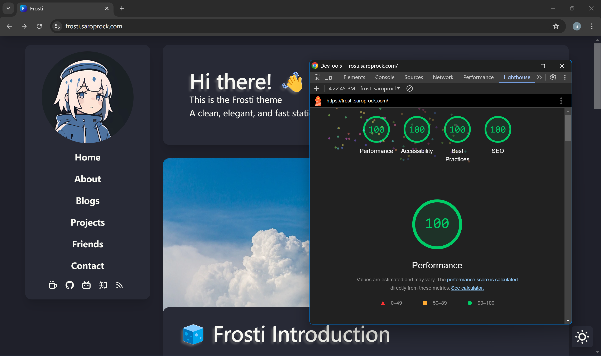
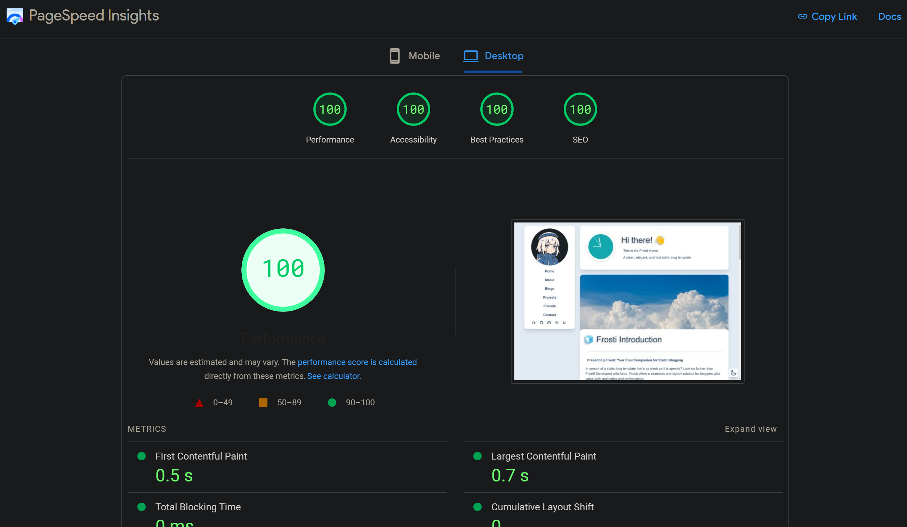

# 🧊 Frosti

**A clean, elegant, and fast static blog template! Developed with [Astro](https://astro.build/)!**

[**🖥️ Frosti Demo**](https://frosti.saroprock.com)&nbsp;&nbsp;&nbsp;/&nbsp;&nbsp;&nbsp;[**🌏 中文 README**](https://github.com/EveSunMaple/Frosti/blob/main/README.zh-CN.md)&nbsp;&nbsp;&nbsp;/&nbsp;&nbsp;&nbsp;[**❤️My Blog**](https://www.saroprock.com)

> [!NOTE]
> For a better reading experience, please visit -> https://frosti.saroprock.com

## 🖥️ Preview


## ⏲️ performance




## ✨ Features

- ✅ Lighthouse 400
- ✅ Blog content support
- ✅ View transition animations
- ✅ You can search your articles
- ✅ **Light** / **Dark** mode available
- ✅ Various components for enriching article content
  - Diverse alerts
  - Code block copy buttons
  - More content supported by [daisyUI](https://daisyui.com/)……
- ✅ Various components for enriching page content
  - Timeline component
  - Friends card component
- ✅ Comment system built with [Waline](https://waline.js.org/)
- ✅ Beautiful pages built with [Tailwind CSS](https://tailwindcss.com/) and [daisyUI](https://daisyui.com/)

> [!NOTE]
> The comment system needs to be configured by oneself, please refer to [Waline](https://waline.js.org/) Change `src\components\Comment.astro`.

## 🚀 Project Structure

```sh
\Frosti
├── 400.png
├── astro.config.mjs
├── categories.txt
├── CHANGELOG.md
├── LICENSE
├── package-lock.json
├── package.json
├── pnpm-lock.yaml
├── public
|  ├── favicon.ico
|  ├── favicon.svg
|  ├── fonts
|  |  └── CascadiaCode.woff2
|  ├── home.webp
|  ├── profile.webp
|  └── view.png
├── README.md
├── src
|  ├── components
|  |  ├── BaseCard.astro
|  |  ├── BaseHead.astro
|  |  ├── blog
|  |  |  ├── error.astro
|  |  |  ├── info.astro
|  |  |  ├── success.astro
|  |  |  └── warning.astro
|  |  ├── Content.astro
|  |  ├── Comment.astro
|  |  ├── EnvelopeCard.astro
|  |  ├── Footer.astro
|  |  ├── FormattedDate.astro
|  |  ├── Header.astro
|  |  ├── HeaderMenu.astro
|  |  ├── License.astro
|  |  ├── page
|  |  |  ├── LinkCard.astro
|  |  |  ├── LinkThere.astro
|  |  |  └── TimeLine.astro
|  |  ├── ProfileCard.astro
|  |  ├── ProfileCardFooter.astro
|  |  ├── ProfileCardMenu.astro
|  |  ├── ProjectCard.astro
|  |  ├── ProjectJS.astro
|  |  └── ThemeIcon.astro
|  ├── consts.ts
|  ├── content
|  |  ├── blog
|  |  |  ├── markdown-style-guide.md
|  |  |  └── using-mdx.mdx
|  |  └── config.ts
|  ├── env.d.ts
|  ├── layouts
|  |  └── BaseLayout.astro
|  ├── pages
|  |  ├── about.mdx
|  |  ├── blog
|  |  |  ├── tag
|  |  |  ├── [...page].astro
|  |  |  └── [...slug].astro
|  |  ├── friend.mdx
|  |  ├── frosti.mdx
|  |  ├── index.mdx
|  |  ├── project.mdx
|  |  └── rss.xml.js
|  ├── scripts
|  |  ├── copybutton.mjs
|  |  └── time.mjs
|  └── styles
|     ├── global.scss
|     └── waline.scss
├── tailwind.config.js
└── tsconfig.json
```

## ✒️ Article Information

|    Name     |       Meaning       | Mandatory |
| :---------: | :-----------------: | :-------: |
|    title    |    Article title    |    Yes    |
| description | Article description |    Yes    |
|   pubDate   |    Article date     |    Yes    |
|    image    |    Article cover    |    No     |
|    tags     |    Article tags     |    No     |
|    badge    |    Article badge    |    No     |

## ⬇️ Usage

Use Frosti by passing the `--template` parameter to the `create astro` command!

```sh
npm create astro@latest -- --template EveSunMaple/Frosti
```

## 🎯 Plans

- [x] Add table of contents (done but CSS not written yet) ~~(Jul 13 2024)~~
- [x] Add timeline component ~~(Apr 21, 2024)~~
- [x] Add friends component ~~(Apr 21, 2024)~~

## 👀 Issues

- [x] ~~`global.css` is too messy~~
- [x] ~~**Light** / **Dark** mode transition ~~currently not implemented~~ `ENOUGH🛠️`
- [x] ~~Website score has not reached 400 points yet~~ `GET IT✨`

## 🎉 Thanks

@[Saicaca](https://github.com/saicaca) His inspiration was the main reason for me to create this theme.

@[WRXinYue](https://github.com/WRXinYue) Helped me a lot when I was first starting out.
