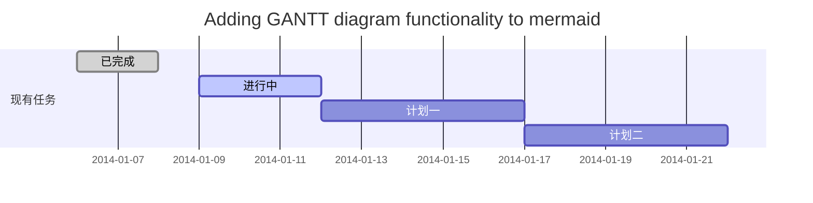
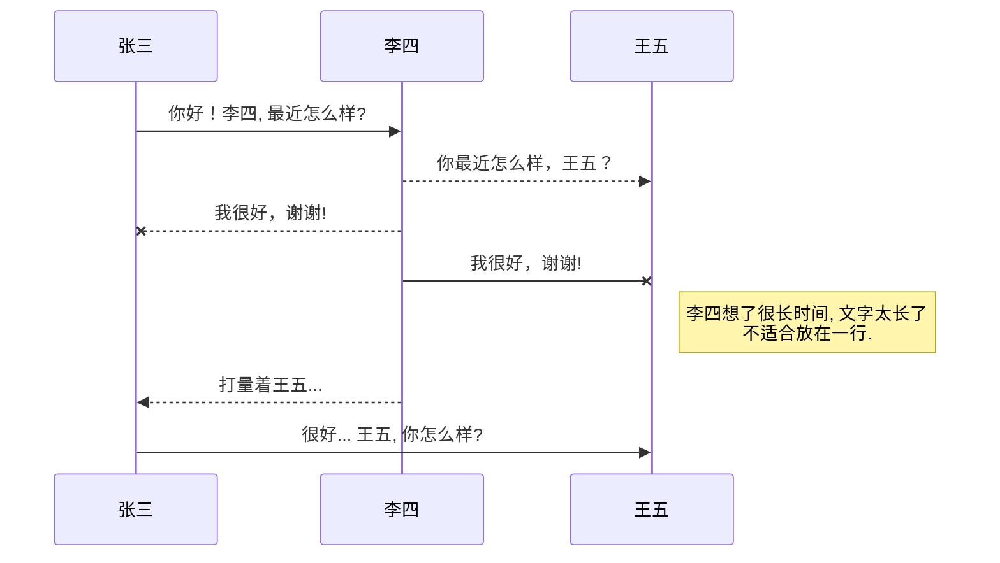
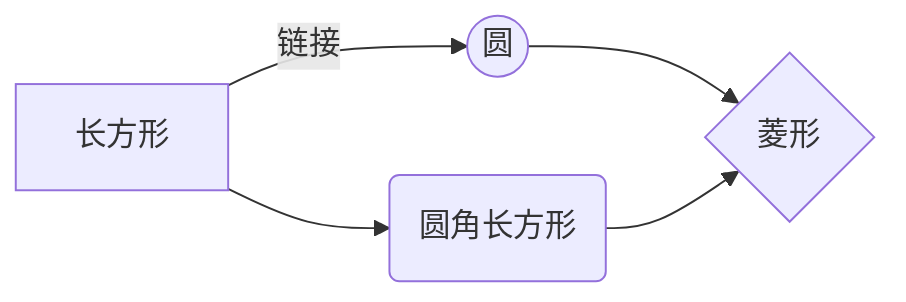

import Kbd from "../../components/blog/kbd.astro";

**具体更新:**
CSDN 新版 Markdown 编辑器（Alpha 2.0 版）使用须知-CSDN 论坛
https://bbs.csdn.net/topics/392449440

@[TOC](这里写自定义目录标题)

# 欢迎使用 Markdown 编辑器

你好！ 这是你第一次使用 **Markdown 编辑器** 所展示的欢迎页。如果你想学习如何使用 Markdown 编辑器, 可以仔细阅读这篇文章，了解一下 Markdown 的基本语法知识。

## 新的改变

我们对 Markdown 编辑器进行了一些功能拓展与语法支持，除了标准的 Markdown 编辑器功能，我们增加了如下几点新功能，帮助你用它写博客：

1. **全新的界面设计** ，将会带来全新的写作体验；
2. 在创作中心设置你喜爱的代码高亮样式，Markdown **将代码片显示选择的高亮样式** 进行展示；
3. 增加了 **图片拖拽** 功能，你可以将本地的图片直接拖拽到编辑区域直接展示；
4. 全新的 **KaTeX 数学公式** 语法；
5. 增加了支持**甘特图的 mermaid 语法[^1]** 功能；
6. 增加了 **多屏幕编辑** Markdown 文章功能；
7. 增加了 **焦点写作模式、预览模式、简洁写作模式、左右区域同步滚轮设置** 等功能，功能按钮位于编辑区域与预览区域中间；
8. 增加了 **检查列表** 功能。
   [^1]: [mermaid 语法说明](https://mermaidjs.github.io/)

## 功能快捷键

撤销：<Kbd>Ctrl/Command</Kbd> + <Kbd>Z</Kbd>

重做：<Kbd>Ctrl/Command</Kbd> + <Kbd>Y</Kbd>

加粗：<Kbd>Ctrl/Command</Kbd> + <Kbd>Shift</Kbd> + <Kbd>B</Kbd>

斜体：<Kbd>Ctrl/Command</Kbd> + <Kbd>Shift</Kbd> + <Kbd>I</Kbd>

标题：<Kbd>Ctrl/Command</Kbd> + <Kbd>Shift</Kbd> + <Kbd>H</Kbd>

删除线：<Kbd>Ctrl/Command</Kbd> + <Kbd>Shift</Kbd> + <Kbd>S</Kbd>

无序列表：<Kbd>Ctrl/Command</Kbd> + <Kbd>Shift</Kbd> + <Kbd>U</Kbd>

有序列表：<Kbd>Ctrl/Command</Kbd> + <Kbd>Shift</Kbd> + <Kbd>O</Kbd>

检查列表：<Kbd>Ctrl/Command</Kbd> + <Kbd>Shift</Kbd> + <Kbd>C</Kbd>

插入代码：<Kbd>Ctrl/Command</Kbd> + <Kbd>Shift</Kbd> + <Kbd>K</Kbd>

插入链接：<Kbd>Ctrl/Command</Kbd> + <Kbd>Shift</Kbd> + <Kbd>L</Kbd>

插入图片：<Kbd>Ctrl/Command</Kbd> + <Kbd>Shift</Kbd> + <Kbd>G</Kbd>

## 合理的创建标题，有助于目录的生成

直接输入 1 次<Kbd>#</Kbd>，并按下<Kbd>space</Kbd>后，将生成 1 级标题。
输入 2 次<Kbd>#</Kbd>，并按下<Kbd>space</Kbd>后，将生成 2 级标题。
以此类推，我们支持 6 级标题。有助于使用`TOC`语法后生成一个完美的目录。

## 如何改变文本的样式

_强调文本_ _强调文本_

**加粗文本** **加粗文本**

==标记文本==

~~删除文本~~

> 引用文本

H~2~O is 是液体。

2^10^ 运算结果是 1024.

## 插入链接与图片

链接: [link](https://mp.csdn.net).

图片: 

带尺寸的图片: 

当然，我们为了让用户更加便捷，我们增加了图片拖拽功能。

## 如何插入一段漂亮的代码片

去[博客设置](https://mp.csdn.net/configure)页面，选择一款你喜欢的代码片高亮样式，下面展示同样高亮的 `代码片`.

```javascript
// An highlighted block
var foo = "bar";
```

## 生成一个适合你的列表

- 项目
  - 项目
    - 项目

1. 项目 1
2. 项目 2
3. 项目 3

- [ ] 计划任务
- [x] 完成任务

## 创建一个表格

一个简单的表格是这么创建的：
| 项目 | Value |
| ---- | ----- |
| 电脑 | $1600 |
| 手机 | $12 |
| 导管 | $1 |

### 设定内容居中、居左、居右

使用`:---------:`居中

使用`:----------`居左

使用`----------:`居右

|     第一列     |         第二列 | 第三列         |
| :------------: | -------------: | :------------- |
| 第一列文本居中 | 第二列文本居右 | 第三列文本居左 |

### SmartyPants

SmartyPants 将 ASCII 标点字符转换为“智能”印刷标点 HTML 实体。例如：

| TYPE             | ASCII                           | HTML                          |
| ---------------- | ------------------------------- | ----------------------------- |
| Single backticks | `'Isn't this fun?'`             | 'Isn't this fun?'             |
| Quotes           | `"Isn't this fun?"`             | "Isn't this fun?"             |
| Dashes           | `-- is en-dash, --- is em-dash` | -- is en-dash, --- is em-dash |

## 创建一个自定义列表

Markdown
: Text-to-HTML conversion tool

Authors
: John
: Luke

## 如何创建一个注脚

一个具有注脚的文本。[^2]

[^2]: 注脚的解释

## 注释也是必不可少的

Markdown 将文本转换为 HTML。

\*[HTML]: 超文本标记语言

## KaTeX 数学公式

您可以使用渲染 LaTeX 数学表达式 [KaTeX](https://khan.github.io/KaTeX/):

Gamma 公式展示 $\Gamma(n) = (n-1)!\quad\forall
n\in\mathbb N$ 是通过欧拉积分

$$
\Gamma(z) = \int_0^\infty t^{z-1}e^{-t}dt\,.
$$

> 你可以找到更多关于的信息 **LaTeX** 数学表达式[here][1].

## 新的甘特图功能，丰富你的文章



- 关于 **甘特图** 语法，参考 [这儿][2],

## UML 图表

可以使用 UML 图表进行渲染。 [Mermaid](https://mermaidjs.github.io/). 例如下面产生的一个序列图：:



这将产生一个流程图。:



- 关于 **Mermaid** 语法，参考 [这儿][3],

## FLowchart 流程图

我们依旧会支持 flowchart 的流程图：

```mermaid
flowchat
st=>start: 开始
e=>end: 结束
op=>operation: 我的操作
cond=>condition: 确认？

st->op->cond
cond(yes)->e
cond(no)->op
```

- 关于 **Flowchart 流程图** 语法，参考 [这儿][4].
